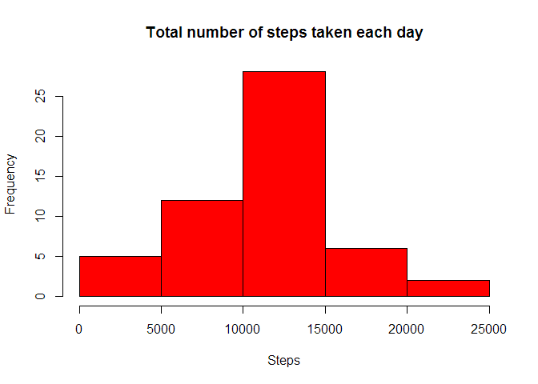

# Reproducible Research: Peer Assessment 1
#Assignment One  
#Reproducible Research  
Setting echo parameter to TRUE so that code chunks are displayed in the final HTML file.

```r
knitr::opts_chunk$set(echo = TRUE)
```

## Loading and preprocessing the data

```r
unzip("activity.zip")
activity.data<-read.csv("./activity/activity.csv", header = TRUE, na.strings = NA)
```
Convert the dates into dates class with as.Date() function  

```r
activity.data$date <- as.Date(activity.data$date, format = "%Y-%m-%d")
```
Calculate total number of steps per day and plot the corresponding histogram

```r
total.steps<-tapply(activity.data$steps, activity.data$date, sum)
hist(total.steps, col = "red", main = "Total number of steps taken each day", xlab = "Steps")
```

<!-- -->


## What is mean total number of steps taken per day?

```r
mean.days<-mean(total.steps, na.rm = TRUE)
median.days<-median(total.steps, na.rm = TRUE)
mean.days
```

[1] 10766.19

```r
median.days
```

[1] 10765


## What is the average daily activity pattern?

```r
average.steps.interval <- tapply(activity.data$steps, activity.data$interval, mean, na.rm = TRUE)
plot(average.steps.interval~as.integer(dimnames(average.steps.interval)[[1]]),ylab = "Average number of steps per interval", xlab ="Interval", main = "Average Daily Activity Pattern", col = "blue", type = "l" )
```

<!-- -->

Which 5 minute interval on average across all the days in the dataset, contains the maximum number of steps?

```r
average.steps.interval[which.max(average.steps.interval)]
```

```
##      835 
## 206.1698
```
Total number of missing values in the dataset

```r
sum(is.na(activity.data$steps))
```

```
## [1] 2304
```
## Imputing missing values
The missing values are filled in with the mean of the 5 minute interval

```r
#Create a new data frame with average number of steps taken per interval
interval <- as.data.frame(average.steps.interval)
#Add a second column containing intervals
interval[,2]<-as.integer(dimnames(interval)[[1]])

#Merge 2 datasets: activity data with mean snumber of steps data
activity.data.nona <- merge(activity.data, interval, by.x = "interval", by.y = "V2")
#Replace the missing values by the mean number of steps in a given interval 
index <-is.na(activity.data.nona$steps)
activity.data.nona$steps[index] <-  activity.data.nona$average.steps.interval[index]
#Drop the last column
activity.data.nona <- activity.data.nona[,1:3]
#Calculate total number of steps using imputed data
total.steps1<-tapply(activity.data.nona$steps, activity.data.nona$date, sum)
hist(total.steps1, col = "green", main = "Total number of steps taken per day with imputed NA's", xlab = "Steps")
```

<!-- -->

```r
#New mean and median calculations using imputed dataset
mean.days.imp<-mean(total.steps1, na.rm = FALSE)
median.days.imp<-median(total.steps1, na.rm = FALSE)
mean.days.imp
```

```
## [1] 10766.19
```

```r
median.days.imp
```

```
## [1] 10766.19
```


## Are there differences in activity patterns between weekdays and weekends?
Add a another column to the imputed data showing wether the day was a weekday or a weekend

```r
weekds <- factor(weekdays(activity.data.nona$date))
#as factors are ordered alphabetically we can regroup the levels with the following assingment 
levels(weekds) <-c("weekday", "weekday", "weekend", "weekend", "weekday","weekday","weekday")
activity.data.nona[,4] <- weekds
```
Plot the data

```r
library(ggplot2)

average.steps <- aggregate(activity.data.nona$steps, 
                           list(activity.data.nona$interval, activity.data.nona$V), mean)
dimnames(average.steps)[[2]]<-c("interval", "days", "average")
g<- qplot(interval, average, data = average.steps, facets =days~., geom=c("line"), xlab = "Interval", ylab = 
            "Average Number of Steps", main = "Average number of steps taken")
g
```

<!-- -->
